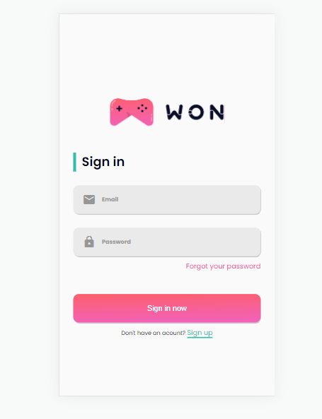
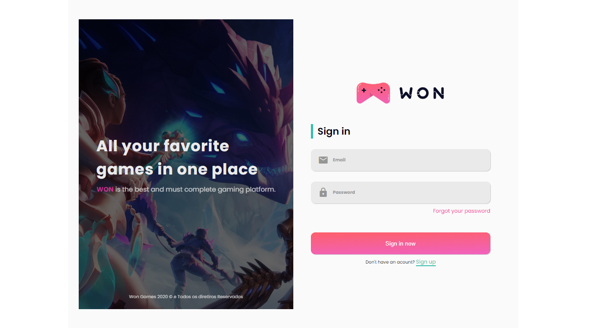

* Este leiaute pertence ao curso do [React avançado](https://www.udemy.com/course/react-avancado) do [Willian justen](https://github.com/willianjusten) por mais que tenha comprado o curso, ainda não o finalizei, simplesmente quis explorar o figma e me desafiar com este protótipo do login.

  
  

<!-- 

 -->

<!--  -->

<!--  -->